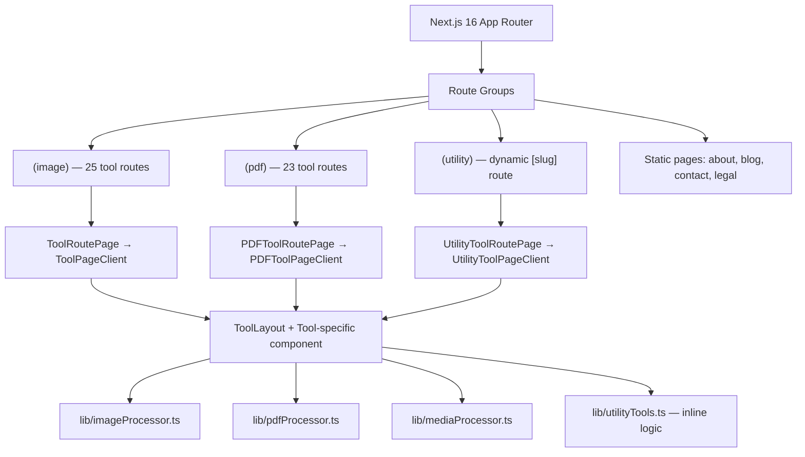

# Code Quality & Architecture Audit — freeconvert.in

> **Focus:** Codebase health, architecture patterns, dependencies, and maintainability  
> **Stack:** Next.js 16, React 19, TypeScript, Tailwind CSS 4, Zustand

---

## 1. Architecture Overview

### Route Organization

| Pattern | Assessment |
|---------|-----------|
| Route groups `(image)`, `(pdf)`, `(utility)` | ✅ Clean separation |
| Static tool pages with shared `ToolRoutePage` | ✅ DRY pattern |
| Dynamic `[utilitySlug]` for 28 utility tools | ✅ Efficient |
| Shared `ToolLayout` component | ✅ Consistent UI |
| Separate `ToolContentSections` for SEO content | ✅ Good separation |

**Grade: ✅ PASS** — Architecture is clean, well-organized, and maintainable.

---

## 2. Component Architecture

### Component Size & Complexity

| Component | Lines | Complexity | Grade |
|-----------|:-----:|:----------:|:-----:|
| `Navbar.tsx` | 333 | High — mega-menu with categories | ⚠️ |
| `NavbarOverlays.tsx` | 497 | High — mobile nav + overlays | ⚠️ |
| `HomeTools.tsx` | 333 | Medium — multiple card variants | ✅ |
| `ToolContentSections.tsx` | 410 | Medium — content rendering | ✅ |
| `ToolLayout.tsx` | 72 | Low — layout wrapper | ✅ |
| `Footer.tsx` | 168 | Low — static links | ✅ |
| `AdSlot.tsx` | 86 | Low — ad rendering | ✅ |
| `ContactForm.tsx` | ~90 | Low — form with hCaptcha | ✅ |
| `CookieConsentBanner.tsx` | ~120 | Medium — consent logic | ✅ |

**Notable patterns:**
- ✅ Server/client component split is well done (only `"use client"` where needed)
- ✅ No prop drilling — tools use Zustand for client state
- ⚠️ `Navbar` + `NavbarOverlays` combined are ~830 lines — consider splitting into smaller subcomponents

### Custom Hooks

| Hook | Purpose | Quality |
|------|---------|:-------:|
| `useAdSenseSlot` | Ad insertion lifecycle | ✅ |
| `useDialogAccessibility` | Focus trap + keyboard nav | ✅ |
| `useHydrated` | SSR hydration detection | ✅ |

---

## 3. Data Architecture

### Tool Configuration (`lib/tools.ts` — 1,360 lines)

The tool configuration file is the largest single file and contains:
- 25 image tool configs (462 lines)
- 23 PDF tool configs (800+ lines)
- Metadata builders, JSON-LD generators, search helpers

| Aspect | Assessment |
|--------|-----------|
| Type safety | ✅ Strong — `ToolSlug` and `PDFToolSlug` union types |
| Content completeness | ⚠️ 24 tools use fallback content (see content audit) |
| Search indexing | ✅ Fuzzy search with `lib/search.ts` |
| URL canonicalization | ✅ `buildToolMetadata` handles canonical URLs |

### Utility Tool Configuration (`lib/utilityTools.ts` — 1,271 lines)

- 28 utility tools, each with embedded `bestFor`, `notes`, `faqs`
- ✅ Better content coverage than image/PDF tools (no fallbacks)
- ⚠️ Still below AdSense content thresholds

### Blog Data (`lib/blog.ts` — 420 lines)

- 8 hardcoded blog posts with sections array
- ✅ JSON-LD generation for BlogPosting + BreadcrumbList
- ❌ No CMS or dynamic content loading — all content is in TypeScript

---

## 4. File Processing Pipelines

### Image Processing (`lib/imageProcessor.ts` — ~580 lines)

| Feature | Implementation | Grade |
|---------|---------------|:-----:|
| Resize | Canvas API with dimension/unit conversion | ✅ |
| Compress | Web Worker + quality loop for target KB | ✅ |
| Convert | Canvas `toBlob()` with format switching | ✅ |
| Crop | CropperJS integration | ✅ |
| Rotate/Flip | Canvas transform operations | ✅ |
| Background removal | `@imgly/background-removal` WASM | ✅ |
| HEIC decoding | `heic2any` library | ✅ |
| OCR | `tesseract.js` with language selection | ✅ |

### PDF Processing (`lib/pdfProcessor.ts` — ~1,000 lines)

| Feature | Implementation | Grade |
|---------|---------------|:-----:|
| Merge | `pdf-lib` page copying | ✅ |
| Compress | Canvas rasterize → re-embed at target DPI | ✅ |
| Split | Page extraction with range parsing | ✅ |
| PDF ↔ Image | `pdfjs-dist` render + `pdf-lib` embedding | ✅ |
| Rotate | `pdf-lib` page rotation | ✅ |
| Watermark | Text/image overlay with `pdf-lib` | ✅ |
| Protect/Unlock | `qpdf-wasm` WebAssembly | ✅ |
| Page numbers | Text drawing with font embedding | ✅ |
| Metadata | `pdf-lib` document info | ✅ |

### Media Processing (`lib/mediaProcessor.ts` — ~150 lines)

| Feature | Implementation | Grade |
|---------|---------------|:-----:|
| Video compress | FFmpeg WASM | ✅ |
| MP4 to MP3 | FFmpeg WASM audio extraction | ✅ |
| MP4 to GIF | FFmpeg WASM with palette | ✅ |
| Audio convert | FFmpeg WASM format switch | ✅ |

**Grade: ✅ PASS** — Processing pipelines are robust, well-implemented, and genuinely client-side.

---

## 5. Error Handling

| Layer | Pattern | Grade |
|-------|---------|:-----:|
| Root error boundary | `error.tsx` + `global-error.tsx` | ✅ |
| 404 handling | `not-found.tsx` | ✅ |
| File validation | `lib/validateFile.ts` with size/type checks | ✅ |
| Input sanitization | `lib/sanitize.ts` with safe parsers | ✅ |
| PDF password errors | Try-catch with user feedback | ✅ |
| WASM load failures | Graceful degradation | ✅ |

---

## 6. Test Coverage

| Test File | Tests | What It Covers |
|-----------|:-----:|----------------|
| `sanitize.test.ts` | ~8 | Input sanitization functions |
| `search.test.ts` | ~6 | Search tokenization and matching |
| `utils.test.ts` | ~8 | Utility functions |
| `validateFile.test.ts` | ~10 | File validation logic |

**Total: ~32 tests**

| Coverage Area | Grade |
|--------------|:-----:|
| Critical sanitization | ✅ |
| Search logic | ✅ |
| File validation | ✅ |
| Image processing | ❌ No tests |
| PDF processing | ❌ No tests |
| Component rendering | ❌ No tests |
| E2E user flows | ❌ No tests |

⚠️ Test coverage is minimal but covers the most important security surfaces (sanitization, validation). Processing tests would need browser APIs/mocks.

---

## 7. Dependency Analysis

### Production Dependencies (36 packages)

| Category | Package | Version | Health |
|----------|---------|---------|:------:|
| Framework | `next` | 16.2.6 | ✅ Current |
| UI | `react` / `react-dom` | 19.2.6 | ✅ Current |
| State | `zustand` | 5.0.13 | ✅ Current |
| PDF | `pdf-lib` | 1.17.1 | ✅ Stable |
| PDF render | `pdfjs-dist` | 5.7.284 | ✅ Current |
| PDF security | `qpdf-wasm` | 0.1.0 | ⚠️ Low version |
| Media | `@ffmpeg/ffmpeg` | 0.12.15 | ✅ Current |
| Image | `browser-image-compression` | 2.0.2 | ✅ Stable |
| OCR | `tesseract.js` | 7.0.0 | ✅ Current |
| BG removal | `@imgly/background-removal` | 1.7.0 | ✅ Current |
| HEIC | `heic2any` | 0.0.4 | ⚠️ Old version |
| Icons | `lucide-react` | 1.14.0 | ✅ Current |
| UI primitives | `@radix-ui/*` | Various | ✅ Current |
| Captcha | `@hcaptcha/react-hcaptcha` | 2.0.2 | ✅ Current |
| Analytics | `@vercel/analytics` | 2.0.1 | ✅ Current |
| Rate limiting | `@upstash/ratelimit` + `@upstash/redis` | Current | ✅ |

**No security vulnerabilities detected in the package structure.**

### Bundle Impact Notes

| Library | Approximate Size | Loaded When |
|---------|:---------------:|-------------|
| `pdfjs-dist` worker | 1.2 MB | Any PDF tool |
| `qpdf.wasm` | 2.2 MB | Protect/Unlock PDF |
| `@ffmpeg/*` | ~25 MB | Video/audio tools |
| `@imgly/background-removal` | ~6 MB model | Background removal tool |
| `tesseract.js` worker | ~2 MB | OCR tool |

✅ Heavy libraries are only loaded per-tool, not globally. This is the correct pattern.

---

## 8. TypeScript Quality

| Aspect | Assessment | Grade |
|--------|-----------|:-----:|
| `strict` mode | Enabled via `tsconfig.json` | ✅ |
| Type unions for slugs | `ToolSlug`, `PDFToolSlug`, `UtilityToolSlug` | ✅ |
| Shared interfaces | `ToolConfig`, `PDFToolConfig`, `UtilityToolConfig` | ✅ |
| Type-safe defaults | `getToolDefaults()` with sanitized search params | ✅ |
| No `any` in critical paths | Verified in processors | ✅ |

---

## 9. Security Review

| Area | Implementation | Grade |
|------|---------------|:-----:|
| XSS prevention | `safeJsonLd()` for JSON-LD injection | ✅ |
| File validation | Type + size checks before processing | ✅ |
| Input sanitization | `safeNumber`, `safeString`, `safeEnum`, etc. | ✅ |
| CSP headers | Comprehensive Content-Security-Policy | ✅ |
| HSTS | 2 years with preload | ✅ |
| Cookie consent | GDPR-compliant with Consent Mode v2 | ✅ |
| Rate limiting | Upstash Redis for API routes | ✅ |
| CAPTCHA | hCaptcha on contact form | ✅ |
| SVG sanitization | SVG cleaning before rasterization | ✅ |
| No server file upload | All processing is client-side | ✅ |

**Grade: ✅ PASS** — Security implementation is thorough.

---

## 10. Summary Scorecard

| Category | Grade | Notes |
|----------|:-----:|-------|
| Architecture | ✅ | Clean Next.js 16 app router structure |
| Component design | ✅ | Good server/client split, DRY patterns |
| Data architecture | ⚠️ | Hardcoded content limits scalability |
| File processing | ✅ | Robust client-side pipelines |
| Error handling | ✅ | Proper boundaries and validation |
| Test coverage | ⚠️ | Minimal — critical paths only |
| Dependencies | ✅ | Current, no vulnerabilities |
| TypeScript | ✅ | Strict mode, proper typing |
| Security | ✅ | Enterprise-grade headers and validation |
| Bundle strategy | ✅ | Per-tool lazy loading |

> [!NOTE]
> The codebase is professionally built with strong technical foundations. The AdSense rejection is **purely a content volume and quality issue**, not a code problem. The architecture is ready to support the additional content needed for approval.
